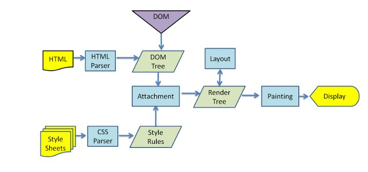

리액트에서 쓰이는 Virtual DOM에 대해 이해하기 위해 여러 글과 유튜브들을 보았다.
하지만 이해가 가지 않았다. Virtrual DOM이 무엇이고 그래서 어떠한 원리로 좋다는 것인지.
포기하기 보다 끝까지 공부하고 조사해보았다.




글을 진행 하기 앞서 브라우저 렌더링에 대해 잠시 설명이 필요할 것 같다.

- 브라우저에서 HTML문서를 받으면 DOM Tree 생성
- Render Tree 생성
- Layout(reflow)
- Painting

하나의 HTML의 문서가 그려지기 까지 위와 같은 과정을 거치고 만약 DOM을 조작해 뷰가 바뀌어야 하면 위의 과정을 반복해 바꾸어진 결과를 보여준다.

_Virtual DOM은 뷰에 변화를 먼저 Virtual DOM에 적용시킨 후 한번에 DOM에 전달해 줌으로써 브라우저내에서 발생하는 양을 줄이면서 성능이 개선됩니다._

결국 요점은 Virtual DOM을 이용해 브라우저 렌더링 횟수를 줄여 준다 이지만 두가지 이해가 가지 않는 부분이 있었다.

- Virtual DOM은 DOM을 추상화한 DOM 입니다.

  그래서 Virtual DOM의 구체적인 형태가 뭐야?

- Virtual DOM을 이용해 여러번 DOM에 업데이트 해야 할 것을 한번에 업데이트 합니다.

  리액트라는 라이브러리도 결국 JS로 이루어진 라이브러리인데 어떻게 DOM 업데이트를 한 번에 한다는거지?

이러한 궁금증에 더 검색해보던중 내 궁금증을 해결해준 [블로그글](https://medium.com/@deathmood/how-to-write-your-own-virtual-dom-ee74acc13060)을 읽었다.

글의 내용은 Vanila JS로 가상화돔을 구현해나가는 과정을 알려주는 글이고 설명이 참 잘되어있다.

위 글을 통해 이해한 내용을 정리해 보겠다.

결국 Virtual DOM은 DOM을 추상화해 어떤 태그, Attribute, Child를 가지는지를 나타낸 트리형태의 자료형이였다.

Virtual DOM이 DOM Tree의 여러가지 변경 사항이 있을경우 어떻게 렌더링 횟수를 줄여주는지 예시를 통해 설명해 보겠다.

```html
<!DOCTYPE html>
<html>
  <head> </head>
  <body>
    <div id="root">
      <ul class="list">
        <li>apple</li>
        <li>banana</li>
        <li>mango</li>
      </ul>
    </div>
  </body>
</html>
```

위와 같은 구조를 가진 페이지가 있다고 할 경우 li노드들의 컨텐트들을 다음과 같이 바꾸고자 한다.

```html
<!DOCTYPE html>
<html>
  <head> </head>
  <body>
    <div id="root">
      <ul class="list">
        <li>red apple</li>
        <li>yellow banana</li>
        <li>yellow mango</li>
      </ul>
    </div>
  </body>
</html>
```

우선 비효율적으로 업데이트를 하는 경우를 보자

```javascript
const root = document.querySelector("#root");
const liTags = root.querySelectorAll("li");

// 화면 렌더링 발생 1
liTags[0].textContent = "red apple";

// 화면 렌더링 발생 2
liTags[1].textContent = "yellow banana";

// 화면 렌더링 발생 3
liTags[2].textContent = "yellow mango";
```

다음과 같이 하나의 업데이트마다 뷰의 변화가 생기면 그 때 마다 브라우저는 다시 화면을 그리는 계산을 하고 이 부분이 잦은 돔조작으로 생기는 성능의 병목점이 된다.

단순한 텍스트 컨텐츠만 바꾼것을 예시로 들었지만 돔이 사라지고 생기고 레이아웃이나 CSS 속성이 바뀐다면 브라우저는 그래픽 계산을 그 때마다 다시하기 때문에 비효율적인 업데이트가 된다.

그러면 단 한번의 돔 조작으로 업데이트를 해보자.

```javascript
const root = document.querySelector("#root");
const virtualDOM = document.createElement("ul");
virtualDOM.classList.add("list");

const appleLI = document.createElement("li");
appleLI.textContent = "red apple";

const bananaLI = document.createElement("li");
bananaLI.textContent = "yellow banana";

const mangoLI = document.createElement("li");
mangoLI.textContent = "yellow mango";

virtualDOM.appendChild(appleLI);
virtualDOM.appendChild(bananaLI);
virtualDOM.appendChild(mangoLI);

// 이 때 한번 뷰가 다시 렌더링 되어 진다.
root.replaceChild(virtualDOM, root.querySelector("ul"));
```

위의 코드에서 replaceChild하기 전에는 자바스크립트 메모리 영역에서만 일어나는 일이므로 화면에 영향을 끼치지 않고 replaceChild할 경우에만 단 한번 화면을 그리는 계산을 하게 된다.

### 결론

리액트를 사용하는것이 무조건적인 성능 향상이 아니라는 점은 위의 예시를 통해 (당연한 이야기지만) 바닐라 자바스크립트로도 충분히 구현 가능하다는 것을 알 수 있다. 성능적인 측면도 중요하지만 프론트엔드 뷰 라이브러리를 사용했을 때의 장점은 데이터의 흐름과 구성을 일관되게 해준다는 장점을 가지는 것 같다. 리액트를 사용하기 전에는 데이터의 소스와 돔의 조작에 대한 자유도가 높기 때문에 일관된 패턴의 코드를 짜기 어려웠다. 하지만 리액트를 사용함으로써 데이터의 흐름을 강제하고, 그리고 데이터의 변화에 따른 화면 변화에 보다 덜 신경쓰게 해준다는 점에서 리액트를 사용하면서의 장점을 이해할 수 있었다.
