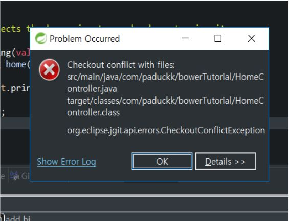

> Egit으로 Pull 해 올 경우 다음과 같은 에러가 나면서 merge가 안되는 경우가 있다.

### 원인

분산형 형상 관리 시스템인 GIT은 remote의 repo와 local repo를 구분하여 관리하고 remote repo의 를 받아와 local에 합치는게 pull (fetch + merge) 명령이다.
merge하는 경우 remote와 local에서 수정한 부분이 겹치면 conflict가 나게되면서 수정후 재 커밋을 해야한다. 하지만 위와 같은 에러가 나면 conflict가 나지도 않고 merge가 아예 진행이 되어버리지 않는다. 원인은 working tree에 있는 파일들(local에서 작업 후 커밋 되어지지 않은 변경사항)이 conflict가 나는게 주 원인 이였다.  

### 해결법

해당 파일을 커밋 후 다시 pull(merge) 하면 아마 conflict가 날 것이고 해결 후 다시 커밋하면 된다.

될 수 있으면 pull 해 올 경우 작업한 파일들을 commit후 pull하는 습관을 들이면 좋을것 같다.
