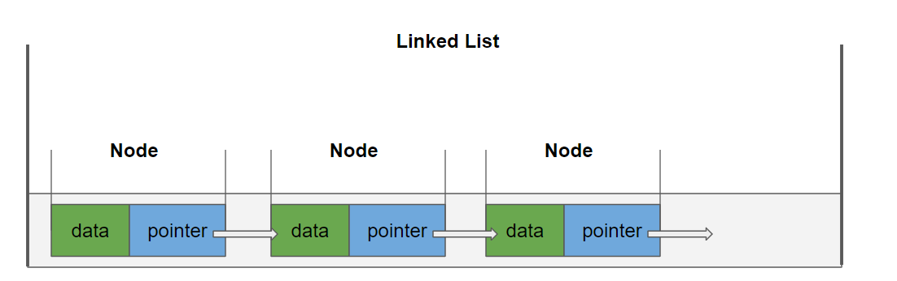
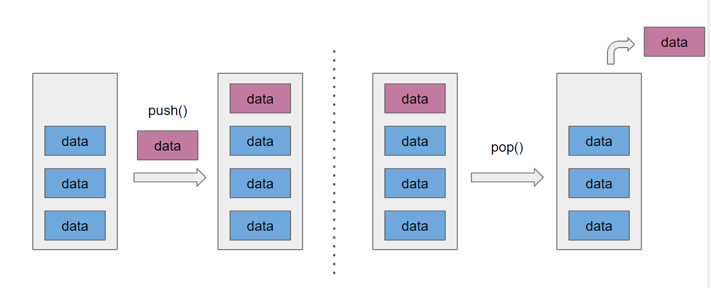
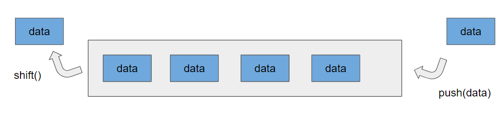

우선 자료구조들을 조사해보고 구현해야 될 기능들을 정리해보았다. 수도코드를 작성 해보고 남은 자료구조 스프린트 기간동안 구현해보자

## Linked List

> 하나의 노드가 다음 노드의 주소 정보를 가진 노드들로 이루어진 리스트이다.

### property

**lenth** : 배열의 길이

**head** : 첫노드의 주소

### method

**add(value, index)** : index가 없는 경우 value를 가진 node를 맨 마지막에 추가 index 가 있는 경우 해당 index 뒤에 추가

**search(index)** : 해당 index의 node의 value를 리턴한다.

**remove(index)** : 해당 index의 node를 삭제 한다.

## Stack

> LIFO 한 쪽 끝에서만 자료를 넣고 뺄 수 있는 형식의 자료구조 따라서 제일 마지막에 들어온 것이 제일 먼저 나가게 된다.

### property

**top** : 맨 상단 노드

**length** : 자료구조의 길이

### method

**push(value)** : 맨 상단에 value를 가진 노드 추가

**pop()** : 맨 상단 노드를 제거

## Queue

> FIFO 처음 들어온게 처음 나가게 되는 자료구조

### property

**length** : 자료구조의 길이

**head** : 맨 앞 노드

**rear** : 맨 뒤의 노드

### method

**push(value)** : 맨 뒤에 value를 가진 노드 추가

**shift()** : 맨 앞 노드 제거 

