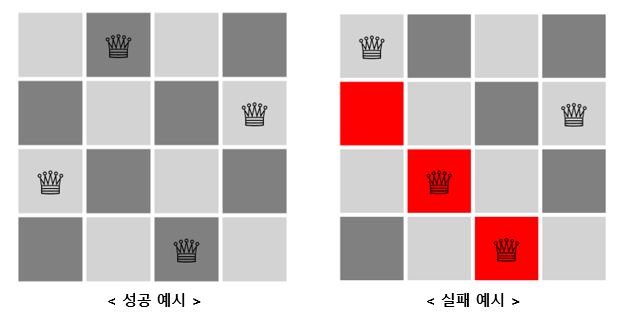
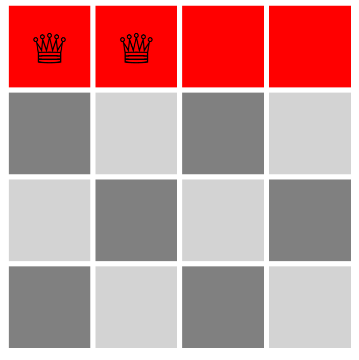
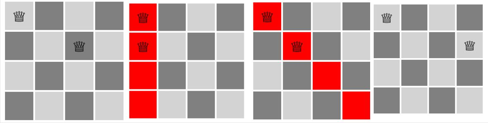
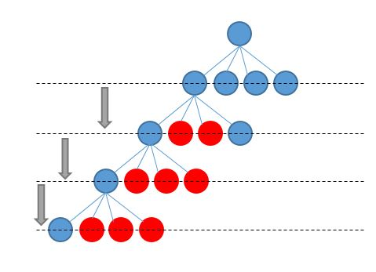

## N-Queens 문제란?

nxn크기의 체크판이 있을때 서로 공격 할 수 없는 n개의 queen을 놓을 수 있는 경우의 수를 구하는 문제! 이다.

## 문제 해결을 위한 접근 법....

N-Queens를 해결하기 위해 고민해보았다.

먼저 첫번째 행에 놓는 경우 해당 행에는 더이상 말을 놓을 수 없다.

다음 행으로 넘어 가게되면 4개의 경우의 수가 생긴다. 바꾸어 말하면 n 개의 경우의 수가 생긴다 하지만 이 중 column으로 충돌이 일어나는지 대각선으로 출돌이 일어나는지 확인이 필요하다.

n개의 경우의 수 중 가능한 하나를 선택하고 다음 경우의 수를 선택해 최종적으로 n번 이동 했을때 n개가 놓인다면 해당 문제의 답이 된다.

이 문제는 마치 트리구조를 탐색해 n레벨의 자식을 찾아가는 문제와 같다.

n-queens의 경우의 수를 모두 탐색하기 위해 이 때 가장 많이 쓰는 알고리즘이 백트래킹이다.

백트래킹은 우선 어떤 하나의 가능한 케이스를 확인하고 가능하지 않다면 다시 돌아와 다음 케이스를 확인하면서 해결책이 나올때까지 이런 과정 반복되도록 한다. 만약 미로를 탐색하다 막힌다면 다시 돌아가 다른길로 가보면서 도착지가 나올때 까지 막힌곳을 돌아가며 길을 찾아 반복할 것이다.

1. 갈림길을 만나면 한 쪽으로 이동한다.
2. 막다른길이면 다시 이전 갈림길로 이동하고 길이 이어지면 계속하여 탐색한다
3. 무한 반복

이 알고리즘을 이용해 N-Queens문제의 수도코드를 작성해보면

1. 행에 첫번째 **열**에 퀸을 놓는다.
2. 다른 퀸과 충돌이 나는지 확인한다.
3. 충돌이 난다면 되돌린후 다음 **열**에 놓는다. 충돌이 안난다면 다음 행으로 넘어간다.
4. 한 행에서 모든 **열**이 충돌이나면 이전 행으로 넘어가 다음 **열**에 퀸을 둔다.
5. 무한 반복

