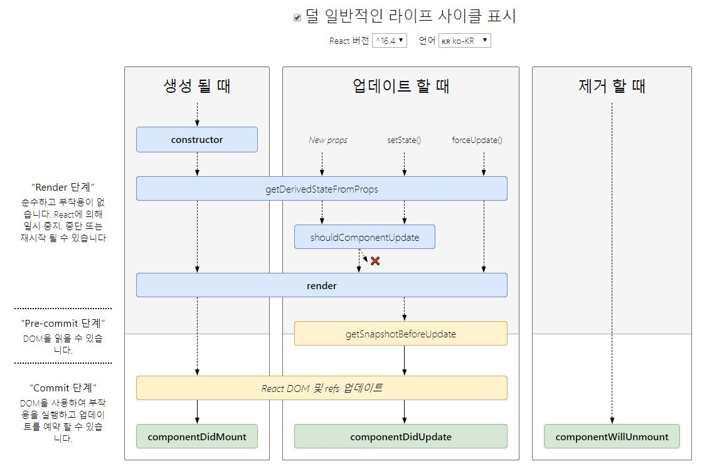

리액트 라이프 사이클이란?

리액트의 각 컴포넌트는 라이프사이클을 가진다. 리액트를 사용해 화면에 뷰가 그려지는 과정은 단순히 보았을때 컴포넌트를 작성한다. 컴포넌트를 ReactDOM.render()를 이용해 그려낸다.

```javascript
const App = () => {
  return (
    <div>
      <h1>Hello World</h1>
    </div>
  );
};

ReactDOM.render(<App />, document.querySelector("#root"));
```

App이라는 컴포넌트가 DOM에 그려지고 없어지기 까지 과정(Life Cycle)이 있고 리액트에선 이 과정 중 하고싶은 일을 정의 하게 해 줄 수 있다. 어떻게? **LifeCycle Methods**를 이용해서



> Source: [https://github.com/wojtekmaj/react-lifecycle-methods-diagram](https://github.com/wojtekmaj/react-lifecycle-methods-diagram)

## Mount

1. constructor()
   - 페이지 로드 되고 컴포넌트가 처음 만들어질때 실행할 코드들을 작성한다.
   - 초기설정 및 State를 정할때 사용한다.
2. static getDerivedStateFromProps(nextProps, prevState)
   - 리턴타입으로 Javascript Object를 주어야 한다. 리턴된 Object는 State에 반영된다.
3. render()
   - 이 메서드는 React Component라면 필수로 가지고 있는 메서드이다. 이 메서드에는 상태를 변경한다던가 하는 Side Effect가 있으면 안된다고 한다.
4. componentDidMount()
   - 컴포넌트가 DOM에 추가 된 후 실행된다.
   - DOM과 상호작용하거나 서드파티 라이브러리들을 사용하는 코드들을 여기서 작성한다.

## Update

1. static getDerivedStateFromProps
   - Mount단계 와 동일하다.
2. shouldComponentUpdate
   - 리턴타입으로 True, False를 주어야 하며 리턴 되는 결과에 따라 DOM에 리 렌더링을 여부를 결정한다.
   - 성능개선하기 위해 사용이 가능하다 한다.
3. render()
   - Mount단계 와 동일하다.
4. getSnapshotBeforeUpdate
   - Virtual DOM이 실제 DOM에 반영되기 직전에 실행된다. 이 메서드에선 이전과 현재의 props와 state를 접근가능하다.
   - return으로 넘겨진 값은 componentDidUpdate의 3번째 인자로 전달된다.
5. componentDidUpdate
   - Mount와 거의 동일하다. 매 업데이트마다 UI sync와 서드파티 라이브러리를 사용하는 코드 작성

## UnMount

1. ComponentWillUnMount
   - 이 메서드는 DOM에서 컴포넌트가 지워질때 실행된다.
   - 컴포넌트와 관련된것들을 정리하는데 사용한다. 예를 들어 로그아웃시 주 구성 Component를 해제하기전에 사용자 세부정보와 모든 인증 토큰을 지운다거나 setInterval을 clear한다거나 할 수 있다.

[LifeCycleTestCode in CodePen](https://codepen.io/dykangdd/pen/eXYyWY)
